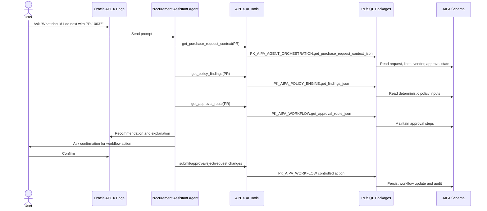

# Architecture

## Overview

AI Procurement Agents is a public Oracle APEX 26.1 demo that shows native AI Agents as controlled application components, not an unrestricted chat integration. The database owns procurement state and rules. APEX controls which data and actions the model can access through AI Tools.

## Schema

Core workflow tables:

- `AIPA_PURCHASE_REQUESTS` and `AIPA_PURCHASE_REQUEST_LINES`
- `AIPA_APPROVAL_STEPS`
- `AIPA_DEPARTMENTS`, `AIPA_EMPLOYEES`, `AIPA_VENDORS`
- `AIPA_PROCUREMENT_POLICIES` and `AIPA_APPROVAL_RULES`

Audit and AI tables:

- `AIPA_AGENT_RUNS`
- `AIPA_AGENT_MESSAGES`
- `AIPA_AGENT_TOOL_CALLS`
- `AIPA_AGENT_RECOMMENDATIONS`
- `AIPA_APP_SETTINGS`

## Business Logic

- `PK_AIPA_POLICY_ENGINE` performs deterministic policy checks and returns JSON findings.
- `PK_AIPA_WORKFLOW` enforces workflow transitions and approval step maintenance.
- `PK_AIPA_AGENT_ORCHESTRATION` records agent activity and runs mock reviews.
- `PK_AIPA_LLM_PROVIDER` isolates mock/live provider behavior without storing secrets.
- `PK_AIPA_SEED` loads repeatable demo data.

## Native APEX AI Agent Model

The native Shared Component agent is `procurement_assistant_agent`. It is the conversational entry point and must use tools for request context, policy findings, route calculation, and workflow actions. Status-changing tools require human confirmation.

The APEXLang app includes the agent shell. The exact tool setup is documented in `docs/apex-ai-agents-setup.md` because built-in AI Tool plugin static IDs can be environment-specific in offline compiler metadata.

## Agent Loop

1. Understand user intent.
2. Retrieve purchase request context.
3. Retrieve deterministic policy findings.
4. Calculate approval route.
5. Explain the recommendation.
6. Ask for confirmation before sensitive actions.
7. Execute confirmed workflow tools.
8. Persist run, message, tool call, and recommendation audit rows.

## Sequence

## OCI and APEX Setup

Create or use an Autonomous Database, create schema `AIPA`, assign it to workspace `APEXFROMTHEFIELD`, run the database installer, then check/import the APEXLang app. Configure the OpenAI Generative AI Service only when live mode is required.
